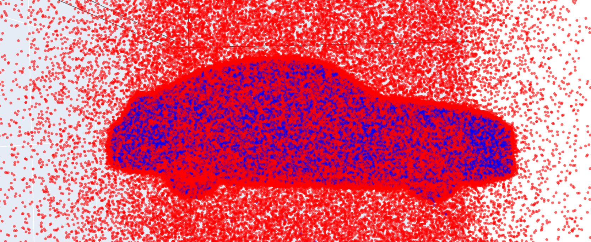

# GenNet

[](https://opensource.org/licenses/MIT)
[](https://www.python.org/)

GenNet is a deep learning framework for predicting the aerodynamic drag coefficient of vehicle shapes and reconstructing their Signed Distance Functions (SDF). This enables the generation of new car geometries optimized for aerodynamic performance. GenNet is based on an autoencoder structure. The model has been trained on the [DrivAerNet++](https://arxiv.org/pdf/2406.09624) Dataset (train set). This repository contains the source code, analysis notebooks, and scripts to train and evaluate the model. You can also read the full work by [clicking on the link](./Mémoire.pdf), where all details concerning the mechanics part and the data processing are given.

## 📋 Table of Contents
- [Installation](#-installation)
- [Usage](#-usage)
- [Repository Structure](#-repository-structure)
- [Results](#-results)
- [Contributing](#-contributing)
- [License](#-license)
- [Contact](#-contact)

---

## 🛠 Installation

### Prerequisites
- Python 3.9+
- pip (or conda)

### Clone the repository
```bash
git clone https://github.com/Bastien-Jacques/GenNet.git
cd GenNet
```
### Create a virtual environement
```bash
python -m venv venv
# Linux/Mac
source venv/bin/activate
# Windows
venv\Scripts\activate
```
### Install dependencies
```bash
pip install -r requirements.txt
```
## 🚀 Usage

### 🧠 Train the Model
To train GenNet on the DrivAerNet++ dataset using the provided configuration file:
```python
train.py --config config.yaml
```
This will start the training process and save model checkpoints in the checkpoints/ directory.

### 🧩 Inference Scripts

The `Inference/` folder contains several scripts for evaluating and post-processing the trained GenNet model:

| Script | Description |
|--------|--------------|
| `Chamfer_Distance.py` | Computes the Chamfer Distance between predicted and ground truth geometries. |
| `Drag_prediction.py` | Predicts the aerodynamic drag coefficient (C<sub>d</sub>) for new geometries using a trained model. |
| `Drag_Optimisation.py` | Performs gradient-based optimization in the latent space to minimize drag. |
| `Drag_Random_Optimisation.py` | Performs random (non-gradient) search in the latent space to explore aerodynamic improvements. |
| `Morphing.py` | Generates morphing between two vehicle geometries by interpolation of their respective latent vectors. |
| `Uncertainty.py` | Estimates model uncertainty on drag prediction using Monte Carlo Dropout. |

Each script can be executed independently:
```python
Inference/Drag_prediction.py --weights checkpoints/best_model.pt --input data
```
by replacing [Drag_prediction] by the wanted code from the Inference folder.


## 📁 Repository Structure
```bash

GenNet/
├── Data_processing/              
│   ├── H5Dataset.py
│   ├── npz_to_h5.py
│   ├── prepare_data.py
│   └── prepare_mesh.py
|
├── Inference/              # Inference and post-processing scripts
│   ├── Chamfer_Distance.py
│   ├── Drag_Optimisation.py
│   ├── Drag_Random_Optimisation.py
│   ├── Drag_prediction.py
│   ├── Morphing.py
│   └── Uncertainty.py
│
├── Models/                 # Autoencoder architecture with or without skip-connections
│   ├── GenNet.py
│   ├── GenNet_skip.py
│   └── GenNet_skip_v2.py
|
├── Notebooks/              # Jupyter notebooks for analysis of the results
│   └── Analyse.ipynb
│   
├── Training/               # Training with or wothout Eikonal Loss 
│   ├── Train.py
│   └── Train_Eikonal.py
│
├── Visualisation/          # 3D visualizations and PCA of latent space
|   ├── Visualisation.py
│   └── PCA.py
│
├── config.yaml             # Configuration file for training
├── requirements.txt        # Python dependencies
├── cd_stats.json           # Dataset statistics
├── Mémoire.pdf             # Full research report
├── LICENSE                 # MIT license
└── README.md               # Project documentation
```


## 📊 Results
GenNet achieves accurate prediction of aerodynamic drag coefficients and high-fidelity reconstruction of 3D geometries on the **DrivAerNet++** dataset.

### Data representation
GenNet is based on a signed distance function's representation of each car sample in the **DrivAerNet++** dataset. Signed Distance Function (SDF) is defined as the function:

$$
\text{SDF}(\mathbf{x}) =
\begin{cases}
+d(\mathbf{x}, \partial \Omega), & \text{if } \mathbf{x} \notin \Omega \\
-d(\mathbf{x}, \partial \Omega), & \text{if } \mathbf{x} \in \Omega
\end{cases}
$$

where $d(\mathbf{x}, \partial \Omega) = \min_{\mathbf{p} \in \partial \Omega} \| \mathbf{x} - \mathbf{p} \|_2$ is the Euclidean distance from a point $\mathbf{x}$ to the surface boundary $\partial \Omega$.

The geometries of the different vehicles in the DrivAerNet++ dataset are originally provided as meshes. The conversion to SDF format was performed by sampling 250,000 points per vehicle within the cube [-1,1]³, after normalization and centering of the meshes.
The isotropic normalization ensures that the model learns patterns related to the shape of the vehicles rather than their absolute size.

To avoid excessive computational cost while maintaining a faithful representation of each vehicle’s structure, 80% of the 250,000 points were sampled close to the surface by adding Gaussian noise (standard deviation 0.01, zero mean) relative to the surface.
The remaining 20% of the points were sampled randomly within the cube.

<p align="center">
  
  
</p>

<p align="center">
  <b>Left:</b> The red points correspond to locations outside the mesh (SDF > 0), while the blue points are inside the mesh (SDF < 0).  <b>Right:</b> Distribution of sampling points as a function of the distance to the mesh
</p>

The geometry of a vehicle is thus fully represented implicitly through the 0-isosurface of the Signed Distance Function. The conversion from meshes to SDF enables an accurate representation of vehicle geometries, as well as the use of fully connected networks and inverse shape generation.

The drag coefficients were normalized using the Min–Max scaling method, with the minimum and maximum values computed only on the training set to prevent any data leakage between the different subsets.
This normalization helps stabilize the training process by ensuring proper gradient propagation.

### Model 

Two different models were created — one with skip connections in the SDF decoder and one without.
The encoder maps the geometry of each vehicle into a latent vector z of dimension 128.
The physical decoder predicts the drag coefficient (C<sub>d</sub>) from this latent vector, while the SDF decoder reconstructs the Signed Distance Function, assigning an SDF value to any point in [-1, 1]³ for a given latent vector.

The encoder is defined as:

$$f_\theta(x, \text{SDF}(x)) = z$$


The physical decoder acts as:

$$g_\theta^{\phi}(z) = \hat{C_d} \approx C_d$$


The SDF decoder acts as:

$$g_\theta^{\text{SDF}}(z, x) = \hat{\text{SDF}}(x) \approx \text{SDF}(x)$$

The architecture of the dual-head autoencoder is shown below.

<p align="center">
  
</p>

<p align="center">
Autoencoder Structure
</p>

Two different model architectures were considered.
One model includes skip connections in its SDF decoder, while the other does not.
The encoder consists of three MLP layers with hidden dimensions of 256.
The physical decoder is composed of either one or three MLP layers (the GenNet_skip_v2 model includes three layers).
Finally, the SDF decoder is made up of six layers, each with hidden dimensions of 256.

<p align="center">
  
  
</p>

<p align="center">
  <b>Left:</b> Geometric decoder without skip-connections  <b>Right:</b> Geometric decoder with skip-connections
</p>

Skip connections make it possible to transmit information from the latent vector during the forward pass and help mitigate the vanishing gradient problem during backpropagation — an issue that can occur when training deep neural networks.
The tests conducted in this work demonstrated the importance of skip connections, as the model equipped with them achieved significantly better performance compared to the model without skip connections.

### ⚙️ Training 

During training, we seek the optimal set of parameters 
$\theta^* = \arg\max_\theta \mathcal{L}(\theta)$
that maximizes the likelihood, defined as:

$$\mathcal{L}(\theta) = \prod_{i=1}^{n} P(y_i \mid f_{\theta}, D)$$

Where $y_i$ refers to an observation from the ground truth values, $f_{\theta}$ the function defined by the model and the weights $\theta$, D to the training data.

In the case of a Gaussian error assumption for the prediction of the drag coefficient, the likelihood associated with the physical prediction is therefore:

$$
\mathcal{L}(\theta)
= \prod_{i=1}^{n}
\frac{1}{\sqrt{2\pi\sigma^2}}
\exp\left(-\frac{(x_i - \mu)^2}{2\sigma^2}\right)
$$

which give the negative log likelihood:

$$
NLL(\theta) =  \frac{n}{2}\log(2\pi\sigma^2) + \frac{1}{2\sigma^2}
\sum_{i=1}^{n}(x_i - \mu)^2
$$

Maximizing the likelihood is therefore equivalent to minimizing the Negative Log-Likelihood (NLL).
In the case of a homoscedastic optimization ($\sigma = 1$), this reduces to minimizing the squared error, leading to the following loss function:

$$
L = \frac{1}{2}\sum_{i=1}^{n}(\hat{C_d} - C_d)^2
$$


The cost function used for the reconstruction of the Signed Distance Function (SDF) is the clamped L1 loss.

$$
L = \sum_{i=1}^{n}|\text{clamp}(SDF,\delta) - \text{clamp}(\hat{SDF},\delta)|
$$

where the clamping function is defined as:

$$
\text{clamp}(x, \delta) =
\begin{cases}
x, & \text{if } |x| < \delta \\
0, & \text{otherwise}
\end{cases}
$$

This geometric Loss function as well as the SDF representation of the shapes are inspired by [Park et al. (2019)](https://arxiv.org/pdf/1901.05103).

Finally, it is also possible to define a regularization loss on the Signed Distance Function (SDF), known as the Eikonal loss.
Indeed, the SDF satisfies the property:

$$
||\nabla \text{SDF}|| = 1
$$

Thus, the regularization loss is defined as the residual of this property:

$$
L_{\text{Eikonal}} = \sum_{i=1}^{n}(||\nabla \text{SDF}|| - 1)^2
$$

This loss can be used by running the training script
```bash
Training/Train_Eikonal.py.
```

For computational efficiency, the SDF gradient is not computed on all 250k sampled points, but only on 25k randomly selected points at each iteration.

Thus, the total cost function used is:

$$
L_{\text{total}} = L_{SDF} + \lambda  L_{C_d} + \lambda_E L_{\text{Eikonal}}
$$

where each weighting coefficient $\lambda$ controls the contribution of the corresponding loss term.

<p align="center">
  
  
</p>

<p align="center">
  <b>Left:</b> Geometric decoder without skip-connections  <b>Right:</b> Geometric decoder with skip-connections
</p>


