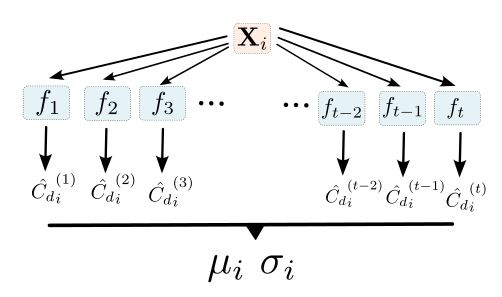

# GenNet

[](https://opensource.org/licenses/MIT)
[](https://www.python.org/)

GenNet is a deep learning framework for predicting the aerodynamic drag coefficient of vehicle shapes and reconstructing their Signed Distance Functions (SDF). This enables the generation of new car geometries optimized for aerodynamic performance. GenNet is based on an autoencoder structure. The model has been trained on the [DrivAerNet++](https://arxiv.org/pdf/2406.09624) Dataset (train set). This repository contains the source code, analysis notebooks, and scripts to train and evaluate the model. You can also read the full work by [clicking on the link](./Mémoire.pdf), where all details concerning the mechanics part and the data processing are given.

## 📋 Table of Contents
- [Installation](#-installation)
- [Usage](#-usage)
- [Repository Structure](#-repository-structure)
- [Work presentation](#-work-presentation)
- [Contributing](#-contributing)
- [License](#-license)
- [Contact](#-contact)

---

## 🛠 Installation

### Prerequisites
- Python 3.9+
- pip (or conda)

### Clone the repository
```bash
git clone https://github.com/Bastien-Jacques/GenNet.git
cd GenNet
```
### Create a virtual environement
```bash
python -m venv venv
# Linux/Mac
source venv/bin/activate
# Windows
venv\Scripts\activate
```
### Install dependencies
```bash
pip install -r requirements.txt
```
## 🚀 Usage

### 🧠 Train the Model
To train GenNet on the DrivAerNet++ dataset using the provided configuration file:
```python
train.py --config config.yaml
```
This will start the training process and save model checkpoints in the checkpoints/ directory.

### 🧩 Inference Scripts

The `Inference/` folder contains several scripts for evaluating and post-processing the trained GenNet model:

| Script | Description |
|--------|--------------|
| `Chamfer_Distance.py` | Computes the Chamfer Distance between predicted and ground truth geometries. |
| `Drag_prediction.py` | Predicts the aerodynamic drag coefficient (C<sub>d</sub>) for new geometries using a trained model. |
| `Drag_Optimisation.py` | Performs gradient-based optimization in the latent space to minimize drag. |
| `Drag_Random_Optimisation.py` | Performs random (non-gradient) search in the latent space to explore aerodynamic improvements. |
| `Morphing.py` | Generates morphing between two vehicle geometries by interpolation of their respective latent vectors. |
| `Uncertainty.py` | Estimates model uncertainty on drag prediction using Monte Carlo Dropout. |

Each script can be executed independently:
```python
Inference/Drag_prediction.py --weights checkpoints/best_model.pt --input data
```
by replacing [Drag_prediction] by the wanted code from the Inference folder.


## 📁 Repository Structure
```bash

GenNet/
├── Data_processing/              
│   ├── H5Dataset.py
│   ├── npz_to_h5.py
│   ├── prepare_data.py
│   └── prepare_mesh.py
|
├── Inference/              # Inference and post-processing scripts
│   ├── Chamfer_Distance.py
│   ├── Drag_Optimisation.py
│   ├── Drag_Random_Optimisation.py
│   ├── Drag_prediction.py
│   ├── Morphing.py
│   └── Uncertainty.py
│
├── Models/                 # Autoencoder architecture with or without skip-connections
│   ├── GenNet.py
│   ├── GenNet_skip.py
│   └── GenNet_skip_v2.py
|
├── Notebooks/              # Jupyter notebooks for analysis of the results
│   └── Analyse.ipynb
│   
├── Training/               # Training with or wothout Eikonal Loss 
│   ├── Train.py
│   └── Train_Eikonal.py
│
├── Visualisation/          # 3D visualizations and PCA of latent space
|   ├── Visualisation.py
│   └── PCA.py
│
├── config.yaml             # Configuration file for training
├── requirements.txt        # Python dependencies
├── cd_stats.json           # Dataset statistics
├── Mémoire.pdf             # Full research report
├── LICENSE                 # MIT license
└── README.md               # Project documentation
```


## 📊 Work presentation
GenNet achieves accurate prediction of aerodynamic drag coefficients and high-fidelity reconstruction of 3D geometries on the **DrivAerNet++** dataset.

### Data representation
GenNet is based on a signed distance function's representation of each car sample in the **DrivAerNet++** dataset. Signed Distance Function (SDF) is defined as the function:

$$
\text{SDF}(\mathbf{x}) =
\begin{cases}
+d(\mathbf{x}, \partial \Omega), & \text{if } \mathbf{x} \notin \Omega \\
-d(\mathbf{x}, \partial \Omega), & \text{if } \mathbf{x} \in \Omega
\end{cases}
$$

where $d(\mathbf{x}, \partial \Omega) = \min_{\mathbf{p} \in \partial \Omega} \| \mathbf{x} - \mathbf{p} \|_2$ is the Euclidean distance from a point $\mathbf{x}$ to the surface boundary $\partial \Omega$.

The geometries of the different vehicles in the DrivAerNet++ dataset are originally provided as meshes. The conversion to SDF format was performed by sampling 250,000 points per vehicle within the cube [-1,1]³, after normalization and centering of the meshes.
The isotropic normalization ensures that the model learns patterns related to the shape of the vehicles rather than their absolute size.

To avoid excessive computational cost while maintaining a faithful representation of each vehicle’s structure, 80% of the 250,000 points were sampled close to the surface by adding Gaussian noise (standard deviation 0.01, zero mean) relative to the surface.
The remaining 20% of the points were sampled randomly within the cube.

<p align="center">
  
  
</p>

<p align="center">
  <b>Left:</b> The red points correspond to locations outside the mesh (SDF > 0), while the blue points are inside the mesh (SDF < 0).  <b>Right:</b> Distribution of sampling points as a function of the distance to the mesh
</p>

The geometry of a vehicle is thus fully represented implicitly through the 0-isosurface of the Signed Distance Function. The conversion from meshes to SDF enables an accurate representation of vehicle geometries, as well as the use of fully connected networks and inverse shape generation.

The drag coefficients were normalized using the Min–Max scaling method, with the minimum and maximum values computed only on the training set to prevent any data leakage between the different subsets.
This normalization helps stabilize the training process by ensuring proper gradient propagation.

### Model 

Two different models were created — one with skip connections in the SDF decoder and one without.
The encoder maps the geometry of each vehicle into a latent vector z of dimension 128.
The physical decoder predicts the drag coefficient (C<sub>d</sub>) from this latent vector, while the SDF decoder reconstructs the Signed Distance Function, assigning an SDF value to any point in [-1, 1]³ for a given latent vector.

The encoder is defined as:

$$f_\theta(x, \text{SDF}(x)) = z$$


The physical decoder acts as:

$$g_\theta^{\phi}(z) = \hat{C_d} \approx C_d$$


The SDF decoder acts as:

$$g_\theta^{\text{SDF}}(z, x) = \hat{\text{SDF}}(x) \approx \text{SDF}(x)$$

The architecture of the dual-head autoencoder is shown below.

<p align="center">
  
</p>

<p align="center">
Autoencoder Structure
</p>

Two different model architectures were considered.
One model includes skip connections in its SDF decoder, while the other does not.
The encoder consists of three MLP layers with hidden dimensions of 256.
The physical decoder is composed of either one or three MLP layers (the GenNet_skip_v2 model includes three layers).
Finally, the SDF decoder is made up of six layers, each with hidden dimensions of 256.

<p align="center">
  
  
</p>

<p align="center">
  <b>Left:</b> Geometric decoder without skip-connections  <b>Right:</b> Geometric decoder with skip-connections
</p>

Skip connections make it possible to transmit information from the latent vector during the forward pass and help mitigate the vanishing gradient problem during backpropagation — an issue that can occur when training deep neural networks.
The tests conducted in this work demonstrated the importance of skip connections, as the model equipped with them achieved significantly better performance compared to the model without skip connections.

### ⚙️ Training 

During training, we seek the optimal set of parameters 
$\theta^* = \arg\max_\theta \mathcal{L}(\theta)$
that maximizes the likelihood, defined as:

$$\mathcal{L}(\theta) = \prod_{i=1}^{n} P(y_i \mid f_{\theta}, D)$$

Where $y_i$ refers to an observation from the ground truth values, $f_{\theta}$ the function defined by the model and the weights $\theta$, D to the training data.

In the case of a Gaussian error assumption for the prediction of the drag coefficient, the likelihood associated with the physical prediction is therefore:

$$
\mathcal{L}(\theta)
= \prod_{i=1}^{n}
\frac{1}{\sqrt{2\pi\sigma^2}}
\exp\left(-\frac{(x_i - \mu)^2}{2\sigma^2}\right)
$$

which give the negative log likelihood:

$$
NLL(\theta) =  \frac{n}{2}\log(2\pi\sigma^2) + \frac{1}{2\sigma^2}
\sum_{i=1}^{n}(x_i - \mu)^2
$$

Maximizing the likelihood is therefore equivalent to minimizing the Negative Log-Likelihood (NLL).
In the case of a homoscedastic optimization ($\sigma = 1$), this reduces to minimizing the squared error, leading to the following loss function:

$$
L = \frac{1}{2}\sum_{i=1}^{n}(\hat{C_d} - C_d)^2
$$


The cost function used for the reconstruction of the Signed Distance Function (SDF) is the clamped L1 loss.

$$
L = \sum_{i=1}^{n}|\text{clamp}(SDF,\delta) - \text{clamp}(\hat{SDF},\delta)|
$$

where the clamping function is defined as:

$$
\text{clamp}(x, \delta) =
\begin{cases}
x, & \text{if } |x| < \delta \\
0, & \text{otherwise}
\end{cases}
$$

This geometric Loss function as well as the SDF representation of the shapes are inspired by [Park et al. (2019)](https://arxiv.org/pdf/1901.05103).

Finally, it is also possible to define a regularization loss on the Signed Distance Function (SDF), known as the Eikonal loss.
Indeed, the SDF satisfies the property:

$$
||\nabla \text{SDF}|| = 1
$$

Thus, the regularization loss is defined as the residual of this property:

$$
L_{\text{Eikonal}} = \sum_{i=1}^{n}(||\nabla \text{SDF}|| - 1)^2
$$

This loss can be used by running the training script
```bash
Training/Train_Eikonal.py.
```

For computational efficiency, the SDF gradient is not computed on all 250k sampled points, but only on 25k randomly selected points at each iteration.

Thus, the total cost function used is:

$$
L_{\text{total}} = L_{SDF} + \lambda  L_{C_d} + \lambda_E L_{\text{Eikonal}}
$$

where each weighting coefficient $\lambda$ controls the contribution of the corresponding loss term.

<p align="center">
  
  
</p>

<p align="center">
  <b>Left:</b> $C_d$ Loss for 250 epochs for two different models with skip connections (S1 = GenNet_skip, S1' = GenNet_skip_v2)  <b>Right:</b> SDF loss for two different models
</p>

<p align="center">
  
</p>

<p align="center">
  SDF gradient norm convergence on 250 epochs
</p>
The weight update was performed using Stochastic Gradient Descent (SGD) with a batch size of B = 8 over 250 epochs.
The optimizer used was Adam, and a learning rate scheduler was also employed to adapt the learning rate dynamically throughout the training process. 

### Results 

GenNet achieved excellent performance both in the prediction of the drag coefficient and in the reconstruction of the Signed Distance Function (SDF). We evaluated the drag coefficient prediction performance using several metrics: the Mean Squared Error (MSE), Mean Absolute Error (MAE), Maximum Absolute Error (MaxAE), and the coefficient of determination R² where:

$$
R^2 = 1 - \frac{\sum_{i=1}^{n} (y_i - \hat{y}_i)^2}{\sum_{i=1}^{n} (y_i - \bar{y})^2}
$$

We also computed the Mean Relative Absolute Error (MRAE) on the test set, as well as the Pearson correlation coefficient to assess the linear relationship between predicted and true drag coefficients.

<p align="center">
  
</p>

<p align="center">
  Performances comparison concernig the prediction of the drag coefficient $C_d$ for several models. 
</p>

<p align="center">
  
  
</p>

<p align="center">
  <b>Left:</b> Barre plot of the Relative Mean Absolute Error (RMAE) between predictions ($\hat{C_d}$) and ground truth ($C_d)$.  <b>Right:</b> Pearson correlation between predictions ($\hat{C_d}$) and ground truth ($C_d)$ .
</p>

The SDF reconstruction performance was evaluated using the Chamfer Distance (CD), defined as:

$$
d_{\text{Chamfer}}(S_1, S_2) =\frac{1}{|S_1|} \sum_{x \in S_1} \min_{y \in S_2} \|x - y\|_2^2 + \frac{1}{|S_2|} \sum_{y \in S_2} \min_{x \in S_1} \|x - y\|_2^2
$$

where $S_1$ and $S_2$ represent the sets of points from the predicted and ground truth surfaces, respectively. The smaller this distance is, the more accurate the reconstruction obtained from the 0-isosurface of a given base shape.

<p align="center">
  
</p>


<p align="center">
  <b>Up:</b> Performances comparison concernig the SDF reconstruction for several models.  <b>Right:</b> Chamfer distance for the test set. Comparison between the differents car shapes in the dataset (Notchback, Fastback, Estateback).
</p>

<p align="center">
  
</p>

<p align="center">
<b>Down:</b> Chamfer distance for the test set. Comparison between the differents car shapes in the dataset (Notchback, Fastback, Estateback).
</p>

As expected, our model is less performant than models dedicated exclusively to geometric reconstruction. Nevertheless, GenNet enables the faithful reconstruction of shapes that were never seen during training.
Furthermore, a simple and visual way to assess the shape generation performance of our model is to perform morphing between different shapes. Below, we show a linear morphing performed between an estateback shape ($\alpha = 0$) and a fastback shape ($\alpha = 1$). All intermediate shapes corresponding to $\alpha \in [0.1,0.9]$ are generated as linear combinations of the two initial latent vectors, according to:

$$
z = \alpha.z_{\text{fastback}} + (1-\alpha).z_{\text{estateback}}
$$

The generated shapes exhibit high quality and smooth transitions, demonstrating the model’s ability to generate new, plausible, and geometrically consistent shapes.

<p align="center">
  
</p>

<p align="center">
Morphing between fastback and estateback shapes.
</p>

### 🧮 Uncertainty prediction

To assess the reliability of the model’s predictions, we implemented an uncertainty estimation method for the drag coefficient predictions.
This uncertainty helps distinguish between high-confidence regions and areas where the model is less certain.
We only considered epistemic uncertainty, stemming from limited knowledge or model generalization capacity.

To estimate the prediction uncertainty, we employed Monte Carlo (MC) Dropout.
This technique generates multiple predictions by keeping dropout active during inference, with the same rate as used during training.
In our case, a dropout rate of $p = 0.05$ was applied only to the layers of the physical decoder.
This means that each neuron has a probability $p = 0.05$ of being dropped (i.e., temporarily deactivated) both during training and inference, thereby introducing stochasticity in the output and allowing uncertainty estimation.

<p align="center">
  
</p>

<p align="center">
Illustation of MC dropout
</p>

Epistemic uncertainty on a prediction \( i \) is determined by the empirical standard deviation:

$$
\hat{\sigma}_i = \sqrt{\frac{1}{N}\sum_{j=1}^{N}\left(\hat{C}_{d,j}^{(i)} - \hat{\mu}_i\right)^2}
$$

with respect to the mean:

$$
\hat{\mu}_i = \frac{1}{N}\sum_{j=1}^{N} \hat{C}_{d,j}^{(i)}
$$

over the different predictions made by **MC Dropout**.

MC Dropout requires calibration in order to provide uncertainty estimates that can be interpreted as confidence intervals.
To achieve this, we perform a calibration of the form $\sigma_{\text{cal}} = \alpha\sigma$
The optimal value of $\alpha$ is determined by minimizing the Gaussian negative log-likelihood (NLL) on the validation set.
Thus, we have:

$$
NLL(\alpha) = \frac{1}{2} \sum_{i=1}^{N} 
\left[
\log\left( 2\pi \alpha \sigma^{(i)} \right)
+ 
\left( 
\frac{ C_d^{(i)} - \mu(\mathbf{x})^{(i)} }{ \alpha \, \sigma^{(i)} }
\right)^2
\right]
$$

By solving $\frac{\partial NLL(\alpha)}{\partial \alpha} = 0$, we obtain:

$$
\alpha^{*} = 
\sqrt{
\frac{1}{N} 
\sum_{i=1}^{N}
\left(
\frac{ C_d^{(i)} - \mu_i }{ \sigma^{(i)} }
\right)^2
}
$$

<p align="center">
  
</p>

<p align="center">
Empirical coverage measured on the test set after dropout calibration, compared with a Normal distribution.
</p>


### Optimisation in latent space.

To generate new car geometries optimized for aerodynamic performance, we employed two different methods.
The first consists in injecting white noise into the latent vectors corresponding to the car samples from the DrivAerNet++ dataset.
However, injecting uniform white noise across all latent components leads to poor results, since each component exhibits different variance within the dataset’s latent space.
Therefore, we inject noise with variance proportional to that of each component, as estimated by Principal Component Analysis (PCA).

The white-noise search was performed by generating one million latent vectors such that:

$$
\mathbf{z}_{\text{gen}} = \mathbf{z}_{\text{train}} + \boldsymbol{\epsilon}
$$

where:

$$
\epsilon_i \sim \mathcal{N}(0, a^2\mathbb{V}(z_i)),
$$

$i$ denotes the $i^{\text{th}}$ component of the vector, and $V(z_i)$ is the variance associated with the $i^{\text{th}}$ component of the latent training space (measured using PCA).

This method allowed us to obtain promising results.Among the one million new latent vectors generated in this way, three produced geometries whose drag coefficients, as estimated by our model, are lower than that of the best geometry in the database in terms of drag performance. A verification using CFD under the same conditions as the DrivAerNet++ dataset remains to be carried out to confirm these results.

<p align="center">
  
  
</p>


<p align="center">
  <b>Up:</b>Projection of the two principal components of the latent vectors from the validation set (in blue) and of the latent vectors generated by white noise (in orange). <b>Down:</b> Best car geometries generated using this method
</p>

The second method consists in performing a gradient descent in the latent space.  
To do so, we start by initializing the search with a starting vector \( z_0 \), generally chosen from the latent vectors of the training set.  
We then perform the descent according to the update rule:

$$
\mathbf{z} := \mathbf{z} - \eta \, \frac{\partial \mathcal{L}}{\partial \mathbf{z}}
$$

where $\eta$ is the learning rate.  

The optimizer used in this part is **Adam**.

The gradient descent is performed on the following generalized loss function:

$$
\mathcal{L} = 
\mathbb{E}_N[\hat{C}_d] + \lambda_{\text{reg}} \cdot \sqrt{\mathbb{V}_N[\hat{C}_d]} 
+ 
\lambda_d \cdot \left(e^{d} - e^{\langle d \rangle}\right)
=\mu 
+ 
\lambda_{\text{reg}} \, \sigma_{\text{epi}} 
+ 
\lambda_d \, \left(e^{d} - e^{\langle d \rangle}\right)
$$

where  
$\mu$ represents the mean prediction over the $N$ MC dropout passes,  $\sigma_{\text{epi}}$ is the measured epistemic uncertainty,  $d$ is the Mahalanobis distance to the closest latent vector from the training set and $\langle d \rangle$ is the average minimal distance between two latent vectors from the training set.  

The exponential term of the distance to the nearest training vector helps penalize potential departures from the manifold. Indeed, generating new shapes that lie far from the latent space learned by the network (extrapolation) leads to poor SDF reconstruction and unreliable drag coefficient predictions. Conversely, generating new shapes by interpolating within the latent space of the training set corresponds to interpolating within the geometric parameter space of the vehicles in the training dataset, which is the desired behavior.

Unfortunately, this method has not yielded conclusive results so far.

### Conclusion 

This work is part of a broader project on 3D shape generation and aerodynamic optimization, combining geometric learning (via SDF) and physical property prediction (drag coefficient $$C_d).The goal was to develop a model capable of encoding a 3D shape into a latent vector and optimizing this vector according to physical criteria while accounting for predictive uncertainty.

A dual-head autoencoder was trained on the DrivAerNet++ dataset to jointly predict the Signed Distance Function (SDF) and the corresponding drag coefficient.A constrained latent-space optimization procedure was then implemented to minimize $C_d$, leveraging MC Dropout to capture epistemic uncertainty and a Mahalanobis distance regularization to remain close to the known shape manifold.

The results show that the model can generate physically plausible and detailed car geometries, while accurately predicting their drag coefficients.

Although the dataset size (≈8000 samples) and the dependence on CFD-generated data limit generalization, the method demonstrates strong potential for data-driven aerodynamic shape optimization.


  


